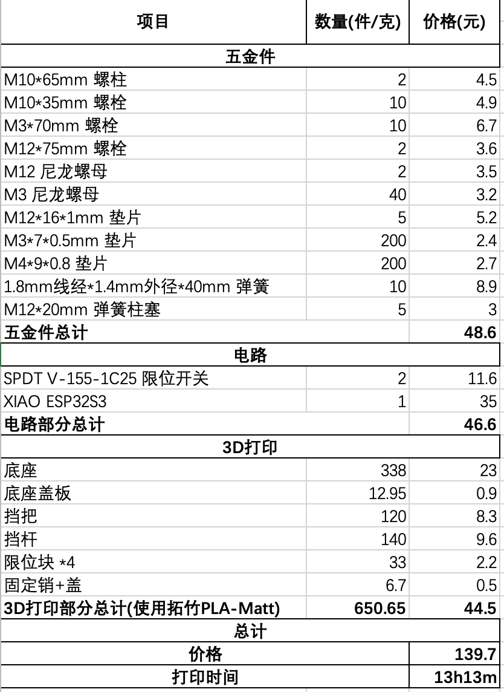

# DIY Sequential Shifter ESP32 BLE ver.
## *This project is still in progress and will subject to change.*
**This project was beased on** https://www.thingiverse.com/thing:4557771  
I simplify the code and manage to make it possible running on a Espressif ESP32 dev kit(no USBHID support) with BLE. 
## Dependency and Library
https://github.com/lemmingDev/ESP32-BLE-Gamepad  
This library turns ESP32 a BLE gamepad that fits multiple scenarios.
## Functions
The original code will turn ESP32 a bluetooth gamepad. When device paired, the board listens to 2 pins input (D25 and D34) as shifting up and down. The on-board led blink twice for shifting up, and once for down. When long-pressing the button (default 800ms), 2 extra physical buttons will be triggered. You can modify the io ports and functions to your like.

## Usage
+ Git clone or download the zip file and decompress.
+ Install VS Code and PlatformIO extension.
+ Select and download the right board driver (ESP32 Dev Kit).
+ Modify sequential_shifter.cpp that fits your perfers.
+ Connect the board and choose the right com port.
+ Build and upload the ROM (hold boot button).
+ Test functions and assembling.
+ Bind keys in game.

## Components needed (Chinese ver.)

Sheets are attached above.

## About 3D printing parts
I slightly adjust the printing parameters. They're about 20% heavier but more stong and reliable. If you hava a BambuLab printer, you can simply import the .3mf file and start printing with PLA-Matt. For any non-bambulab devices, here are the per-component settings:
+ MainBody: 4 walls, 50% adaptive cubic infill with support
+ ShifterShaft: 4 walls, 50% adaptive cubic infill with support
+ Knob: 4 walls, 100% infill
+ Pin, cap, spacer, and bottom cover: 3 walls, 100% infill

**Total filaments used: 650.65g**  
**Total Printing time: 13h13m**

## Acknowledgements
 Introducing my friend and personal sim-racing coach @SanchezYao. I will never made it without his support.  
 Special thanks to [BambuLab](https://bambulab.com/en) for a new P1SC printer and filaments. Their products are one of the most reliable devices you can find in current days.

